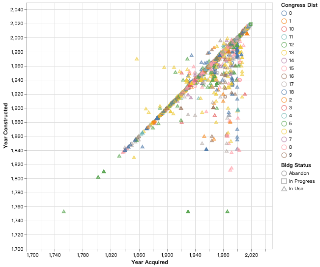
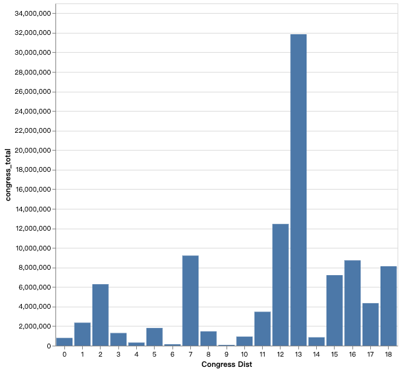

# chiayi0327.github.io

## Instruction 

1. Develop a visualization using vega-lite using the building inventory data
2. Deploy this visualization in JSON format to your GitHub pages
3. Write the initialization javascript code to create the visualization in your page

## Prerequisite

1. Dataset **building_inventory.csv** is in file **data**
2. This visualization is written by vega-lite.

## Conclusion

[1] link : [first image](https://chiayi0327.github.io/)

   

[2] link : [second image](https://chiayi0327.github.io/test.html)

   

[3] link : [IS445example](https://chiayi0327.github.io/course-test.html)

   

